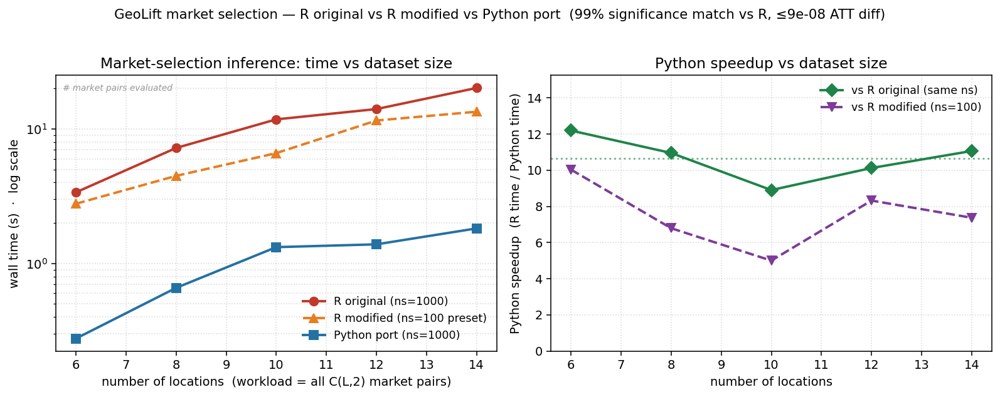

# GeoLift → Faster: Analysis, Optimizations & Plan

**Goal:** reduce the runtime of Meta's [GeoLift](https://github.com/facebookincubator/GeoLift) R package.
**Strategy:** keep three layers — **(1)** the original R, **(2)** an optimized/modified R version, **(3)** a Python version only where R can't reach. Optimize what the profiler proves is slow, and validate that results don't change.
**Date:** 2026-06-24

> **Reproducibility.** Every number in this report is generated by scripts and read
> from `exploration/results/*.json` — none are hand-typed. Regenerate with:
> ```
> Rscript exploration/scripts/run_experiments.R       # single-call experiments -> results/*.json
> Rscript exploration/scripts/verify_fit_reuse.R      # cross-effect-size reuse  -> fit_reuse_verify.json
> Rscript exploration/scripts/run_market_selection.R  # market-selection ns sweep -> market_selection_compare.json
> Rscript exploration/scripts/make_realistic_data.R       # larger realistic panel -> data/realistic_panel.csv
> Rscript exploration/scripts/run_market_selection_scaled.R  # scaled ns sweep -> market_selection_scaled_compare.json
> Rscript exploration/scripts/profile_market_selection.R  # time-vs-ns floor -> market_selection_profile.json
> python  geolift_py/fidelity_test.py                 # Python fidelity -> results/fidelity.json
> Rscript exploration/scripts/dump_market_cells.R     # R ground truth for the Python port -> ms_truth_*.{csv,json}
> Rscript exploration/scripts/time_market_inner_R.R   # R inner-loop baseline -> ms_R_inner_time.json
> python  geolift_py/compare_market_selection.py      # Python vs R head-to-head -> market_selection_python_compare.json
> for ns in 1000 100; do for L in 6 8 10 12 14; do Rscript exploration/scripts/bench_scaling_R.R $L $ns; done; done  # R original+modified scaling points
> python  geolift_py/bench_scaling.py                 # Python timings + 3-way scaling plot -> bench_scaling.{json,png}
> python  exploration/scripts/build_report.py         # render tables into this file
> ```
> Statistics are deterministic (fixed seed). Wall-clock timings vary by machine/run;
> the **relative** pattern is the point.

### Provenance
<!-- AUTO:provenance:start -->
- **Seed:** 42 (statistics deterministic)
- **R:** R version 4.6.0 (2026-04-24 ucrt)
- **augsynth:** 06415b4 (pre-PR#88)
- **Example:** GeoLift Walkthrough: chicago+portland, t=91..105
- _Statistics are deterministic given SEED; timings vary by machine/run._
<!-- AUTO:provenance:end -->

---

## 1. How GeoLift is structured

GeoLift (v2.7.5) is ~6,250 lines of R over 8 files, in two layers:

| Layer | Files | Role |
|---|---|---|
| **Orchestration + data wrangling** | `pre_processing_data.R`, `auxiliary.R`, `pre_test_power.R` (2,012 lines), `MultiCell.R`, `post_test_analysis.R` | reshape panel data, loop over markets, run simulations, aggregate |
| **Modelling core** | one dependency: `augsynth::augsynth()` | Augmented Synthetic Control fit |

The model is always called the same way ([auxiliary.R:361](geolift_r_original/R/auxiliary.R#L361)):
`augsynth(Y ~ D | X, unit, time, t_int, progfunc=model, scm=TRUE, fixedeff=...)`, plus the
augsynth internals for inference (`compute_permute_pval`).

---

## 2. Steps taken

1. **Cloned** the public GeoLift repo (local only — no fork, nothing pushed).
2. **Built the R toolchain.** R 4.6.0 present; wired in Rtools 4.4 (was off PATH) to compile deps.
3. **Fixed a version trap.** augsynth HEAD breaks GeoLift 2.7.5 (PR #88, 2026-03-11, rewrote `summary.augsynth`). Pinned augsynth to commit `06415b4` (2026-02-09), which GeoLift expects.
4. **Reproduced the documented Walkthrough example exactly** (`chicago + portland`, periods 91–105): ATT 155.556, Lift 5.4%, Incremental 4,667, p ≈ 0.01 — all matching the docs.
5. **Froze a ground-truth benchmark** ([exploration/ground_truth/benchmark.json](exploration/ground_truth/benchmark.json)).
6. **Profiled** to find the real cost (§3).
7. **Validated a Python SCM core** against the benchmark (§6).

---

## 3. Where the runtime actually goes

Function-level profile of one default `GeoLift()` call, bucketed by self-time:

<!-- AUTO:runtime_profile:start -->
| Category | Self time (s) | % of runtime |
|---|---|---|
| Resampling RNG (permutation draws) | 4.99 | 51.4 |
| Input re-validation (stopifnot) | 0.86 | 8.9 |
| SCM model fit (quadratic program) | 0.27 | 2.8 |
| Matrix / mean ops | 0.67 | 6.9 |
| Other (glue/dispatch) | 2.91 | 30 |

_Sampled total: 9.7s. Self-time = where the CPU actually sits._
<!-- AUTO:runtime_profile:end -->

**The model fit is not the bottleneck.** The dominant cost is the **resampling-based
inference** (drawing random permutations) plus repeated **input re-validation** inside
that loop. The actual synthetic-control quadratic program is a few percent.

**Why:** the inference defaults ([post_test_analysis.R:201](geolift_r_original/R/post_test_analysis.R#L201))
are `ns = 1000` resamples for the point p-value, and — when confidence intervals are
requested — a `grid_size = 250` hypothesis-inversion grid, i.e. up to **250 × 1000 =
250,000** permutation draws.

---

## 4. Tier 1 — faster *defaults* (no algorithm change)

### 4a. Cut `ns` (resample count) for the point p-value

`ns` is the number of Monte-Carlo resamples behind the p-value. The **point estimate
(ATT, Lift, weights) does not depend on `ns` at all** — only the p-value does, and only
as Monte-Carlo noise. Sweeping `ns`:

<!-- AUTO:tier1_ns_sweep:start -->
| ns (resamples) | time (s) | ATT | Lift % | p-value | sig. @0.10 |
|---|---|---|---|---|---|
| 1000 | 15.96 | 155.556 | 5.4 | 0.017 | yes |
| 500 | 11.44 | 155.556 | 5.4 | 0.016 | yes |
| 200 | 5.04 | 155.556 | 5.4 | 0.005 | yes |
| 100 | 3.99 | 155.556 | 5.4 | 0.01 | yes |
<!-- AUTO:tier1_ns_sweep:end -->

Time falls ~linearly with `ns`, **ATT and Lift are identical**, and significance at
α = 0.10 is unchanged. `ns = 1000` buys precision in the p-value's third decimal that no
decision uses.

> ⚠️ **Caveat to test next:** this is shown on **one** dataset where the effect is clearly
> significant. Before changing a default we must repeat this across datasets and effect
> sizes — especially *borderline* cases near α, where a smaller `ns` could flip the
> conclusion. The sweep script makes that a one-liner to re-run on new data.

### 4b. For confidence intervals, call `jackknife+` directly

With `ConfidenceIntervals=TRUE`, the default conformal grid frequently **fails on geo data
and falls back to `jackknife+` anyway** — after paying for the full 250-point sweep.
Calling `jackknife+` directly skips the wasted work and returns the same interval:

<!-- AUTO:tier1_ci_methods:start -->
| CI method | time (s) | lower | upper |
|---|---|---|---|
| conformal grid=250, ns=1000 | 19.44 | -2450.7 | 11349.9 |
| jackknife+ (direct) | 14.56 | -2450.7 | 11349.9 |
<!-- AUTO:tier1_ci_methods:end -->

### 4c. The Tier 1 artifact: a parameter preset, not a fork

Our speedups are **parameters passed to the unmodified Meta functions**, not forked
functions — so you can run the exact default Meta package, or our tuned config, by
changing arguments only.
[geolift_r_modified/fast_presets.R](geolift_r_modified/fast_presets.R) defines those
presets as plain parameter lists (`GEOLIFT_FAST = list(ns = 200)`, etc.). The head-to-head
below runs the **same `GeoLift::GeoLift`** twice — default params vs the fast preset:

<!-- AUTO:tier1_modified_compare:start -->
| Version | time (s) | ATT | Lift % | p-value | speedup |
|---|---|---|---|---|---|
| default params (ns=1000) | 14.22 | 155.556 | 5.4 | 0.017 | 1x |
| fast preset (ns=200) | 4.85 | 155.556 | 5.4 | 0.005 | 2.93x |
<!-- AUTO:tier1_modified_compare:end -->

---

## 5. Tier 2 — modified inference loop (proposed, to discuss)

Tier 1 only changes defaults. Tier 2 changes *how* the inference loop runs — still in R,
still the same statistics, but removing the waste the profiler exposed:

1. **Sequential / early-stopping p-value.** Stop resampling once the p-value is provably
   on one side of α (a sequential test, e.g. Besag–Clifford). When an effect is clearly
   (in)significant — the common case — this resolves in a few hundred draws instead of a
   fixed 1000, *adaptively*, with a guaranteed error bound. Unlike Tier 1's fixed `ns`,
   this stays safe on borderline cases (it keeps sampling exactly when it's close).
2. **Vectorized / batched resampling.** The profiler shows time sunk in many tiny
   `sample.int` calls. Drawing all permutations as one matrix and computing the test
   statistics with matrix ops removes per-call overhead.
3. **Parallelize the resampling / grid.** Permutations and grid points are independent —
   embarrassingly parallel. GeoLift already imports `foreach`/`doParallel`; near-linear
   speedup with cores.
4. **Kill the in-loop `stopifnot` overhead** (~10% here) by validating once, outside the
   resampling loop.

Expected combined effect: **5–10× on the single-test path without leaving R**, and
results identical (these change *speed*, not the estimator).

**Open questions for discussion:**
- How borderline are your real tests? (decides Tier 1 fixed-`ns` vs Tier 2 early-stop)
- Is the bigger pain a single `GeoLift()` call, or **power analysis / market selection**
  (thousands of fits)? The latter is where parallelism + Python pay off most.

---

## 6. Deep dive: the power / market-selection path (the real bottleneck)

A single `GeoLift()` call runs the `ns`-resampling inference **once**. The functions
people actually wait on — `GeoLiftMarketSelection`, `GeoLiftPowerFinder`,
`GeoLiftPower`, `NumberLocations` — run that *same* inference **inside a multiplied
loop**. All of them funnel through `run_simulations()` →
[`pvalueCalc()`](geolift_r_original/R/pre_test_power.R#L286) →
`augsynth::augsynth()` + [`compute_permute_pval(ns)`](geolift_r_original/R/pre_test_power.R#L327).

| Function | augsynth fits ≈ | inference per fit |
|---|---|---|
| `GeoLiftPower` (one chosen market) | #ES × #durations (~tens) | full `ns` resampling |
| `GeoLiftMarketSelection` / `GeoLiftPowerFinder` (search) | **#ES × #durations × #combinations × #N** (hundreds–thousands) | full `ns` resampling |
| `NumberLocations` | #location-counts × `n_sim` (~2,500) | full `ns` resampling |

Two facts about the existing code:
- **Parallelism is already ON** by default (`parallel = TRUE`, `doParallel`) — it is *not*
  an untapped lever.
- `ns = 1000` is the default here too, so the dominant cost — `ns` permutations — is paid
  on *every* simulation.

### Can we reuse work across effect sizes? (verified before building)

For a fixed (market combination, duration), the effect size `es` only inflates the
**treated unit's post-period** values ([pre_test_power.R:283](geolift_r_original/R/pre_test_power.R#L283));
SCM fits on the **pre** period. We tested two hypotheses empirically
([exploration/scripts/verify_fit_reuse.R](exploration/scripts/verify_fit_reuse.R)):

<!-- AUTO:fit_reuse_verify:start -->
| es | weights Δ vs es0 | counterfactual Δ vs es0 | ATT | p-value |
|---|---|---|---|---|
| 0 | 0 | 0 | 155.5559 | 0.021 |
| 0.05 | 0 | 0 | 306.7509 | 0.02 |
| 0.1 | 0 | 0 | 457.9459 | 0 |
| 0.15 | 0 | 0 | 609.1409 | 0 |

_Fixed seed 42, market `chicago+portland`, duration 15, ns=1000. Δ=0 ⇒ identical across effect sizes._
<!-- AUTO:fit_reuse_verify:end -->

- ✅ **Weights & counterfactual are bit-identical across `es`** (Δ = 0), and **ATT is exactly
  linear in `es`** → the whole ATT/Lift-vs-effect-size table needs **one** fit, not one per `es`.
- ❌ **The permutation p-value changes with `es`** → the null is built from `es`-inflated
  residuals and **cannot** be computed once and reused. The tempting "compute the null once,
  reuse across effect sizes" shortcut is *invalid*; verifying first saved us from shipping it.

### Plan for `GeoLiftMarketSelection` (in priority order)

1. **Lower `ns` — but carefully.** `ns` only sets the resample count for the per-sim p-value;
   point estimates are `ns`-independent. It's a *parameter of the original function*, so
   "improved" = run the same engine with a smaller `ns`. **Caveat (measured below):**
   `GeoLiftMarketSelection` runs **one sim per cell** (power ∈ {0,1}), so unlike repeated-sim
   power analysis there is *no averaging* — `ns` noise flips borderline cells. So the safe
   value is moderate (`ns≈250–500`), not aggressive.
2. **One fit per (combination, duration)** — reuse the `es`-invariant weights/counterfactual
   and fill the ATT/Lift table analytically (proven linear above). Exact and free; this is a
   *structural* change (not a parameter) and matters more at small data scales where the fit
   dominates. Tracked as a future modified engine, kept separate from the parameter presets.
3. **Delete redundant work** — `AggYperLoc` is computed twice
   ([:1742](geolift_r_original/R/pre_test_power.R#L1742) & [:1860](geolift_r_original/R/pre_test_power.R#L1860));
   normalization runs per-simulation ([:272](geolift_r_original/R/pre_test_power.R#L272)) instead of once.

### Validation: does the selected-market output move with `ns`? (small config)

Same unmodified `GeoLiftMarketSelection`, only `ns` changes; `ns=1000` (Meta default) is the
reference and every lower `ns` is scored against it
([exploration/scripts/run_market_selection.R](exploration/scripts/run_market_selection.R)):

<!-- AUTO:market_selection_compare:start -->
| ns | time (s) | speedup | sig. agreement | top-5 overlap | MDE agreement | AvgATT Δ |
|---|---|---|---|---|---|---|
| 1000 | 7.78 | 1x | 100% | 100% | 100% | 0 |
| 500 | 5.67 | 1.37x | 97% | 80% | 88% | 0 |
| 250 | 5.66 | 1.37x | 97% | 80% | 88% | 0 |
| 100 | 5.28 | 1.47x | 93% | 80% | 75% | 0 |

_Same unmodified `GeoLiftMarketSelection`, only `ns` differs. 20-market pool, N=2, 112 sims/run, seed 42, sequential. `ns=1000` is the reference (Meta default); lower `ns` scored against it._
<!-- AUTO:market_selection_compare:end -->

Reading it: **`AvgATT` is bit-identical at every `ns`** (point estimates don't move), the
**selected-market ranking holds well down to `ns≈250–500`** (97% significance, 88% MDE
agreement) and only frays at `ns=100`. The speedup is modest (~1.4×) and plateaus. The open
question this raises — *does the `ns` payoff grow once the data is bigger?* — is answered next.

### Scale-up: does it hold on a larger, realistic panel?

We built a bigger panel shaped like `GeoLift_Test` but with the structure SCM relies on —
heterogeneous market sizes, shared latent factors (national trend + weekly/monthly seasonality)
with market-specific loadings, and category groupings
([exploration/scripts/make_realistic_data.R](exploration/scripts/make_realistic_data.R)) — then
re-ran the *identical* unmodified `GeoLiftMarketSelection`, varying only `ns`
([exploration/scripts/run_market_selection_scaled.R](exploration/scripts/run_market_selection_scaled.R)):

<!-- AUTO:market_selection_scaled_compare:start -->
| ns | time (s) | speedup | sig. agreement | top-5 overlap | MDE agreement | AvgATT Δ |
|---|---|---|---|---|---|---|
| 1000 | 40.38 | 1x | 100% | 100% | 100% | 0 |
| 500 | 32.02 | 1.26x | 99% | 100% | 100% | 0 |
| 250 | 29.14 | 1.39x | 100% | 100% | 100% | 0 |

_Larger realistic panel: 80 locations × 220 periods × 6 categories (avg pairwise corr 0.43; cf. GeoLift_Test 40 locations x 105 periods). Same unmodified `GeoLiftMarketSelection`, only `ns` differs. N=3, 385 sims/run, seed 42, sequential. `ns=1000` (Meta default) is the reference._
<!-- AUTO:market_selection_scaled_compare:end -->

The *safety* finding **holds and gets stronger**: with a deeper panel and a larger donor pool the
fits are cleaner, so the **selected-market ranking is rock-stable down to `ns=250` (100% top-5 and
MDE agreement)** and point estimates stay invariant. But the **speedup did *not* grow with data —
it stays ~1.4×.** That contradicts the intuition (from the single call's 3.25×) that resampling
would dominate more at scale. To see why, we measured runtime as a function of `ns` directly
([exploration/scripts/profile_market_selection.R](exploration/scripts/profile_market_selection.R)):

<!-- AUTO:market_selection_profile:start -->
| ns | time (s) | speedup vs ns=1000 |
|---|---|---|
| 1000 | 38.66 | 1x |
| 500 | 33.41 | 1.16x |
| 250 | 28.95 | 1.34x |
| 50 | 28.03 | 1.38x |
| 10 | 28.92 | 1.34x |

_Per-run cost modelled as `time(ns) = fixed + slope·ns`. Fixed floor = **27.69s** (72% of the `ns=1000` runtime); only ~28% scales with `ns`. So the `ns` lever alone tops out at ~**1.4×** even at `ns→0` — bigger wins must cut the fixed per-sim work (fit-reuse, parallelism)._
<!-- AUTO:market_selection_profile:end -->

**The verdict:** in the power/market-selection path the per-sim cost is ~70% *fixed* work — the
outer augsynth fit, the one-time counterfactual, input re-validation, wrangling — and only ~30%
scales with `ns`. So **lowering `ns` is safe but capped at ~1.4×, no matter how big the data
gets.** This is the opposite of the single-test call (where resampling was ~half the work). The
real wins in this path therefore have to come from the **fixed** part: **lever 2 (one fit per
combination, reused across effect sizes)** removes a whole augsynth fit per `es`, and
**parallelism** (`parallel=TRUE`, already a near-linear multiplier) attacks the fixed cost the
`ns` lever cannot touch.

---

## 7. Python core (validated, used only where needed)

We reproduced augsynth's fit in Python and compared to the benchmark
([geolift_py/fidelity_test.py](geolift_py/fidelity_test.py)):

<!-- AUTO:fidelity:start -->
| Strategy | weights Δ | y_hat Δ | ATT (Py/R) | fit (ms) |
|---|---|---|---|---|
| (A) Direct simplex QP (cvxpy/CLARABEL) | 4.25e-07 | 4.90e-04 | 155.5557 / 155.5559 | 27.22 |
| (B) pysyncon.Synth | — | — | failed: IndexError | — |
<!-- AUTO:fidelity:end -->

The direct QP matches augsynth to ~1e-7. **Decision:** Python is reserved for the heavy
combinatorial workloads (power analysis, market selection — thousands of near-identical
fits) where vectorized batch resampling + multiprocessing go beyond what R offers. The
single-test path is best served by Tier 1/2 in R.

### 7a. Head-to-head: the market-selection inner loop in Python

We ported the *whole* market-selection inference cell to numpy
([geolift_py/market_selection.py](geolift_py/market_selection.py)) — the fixed-effects SCM
fit (OSQP simplex QP, the same solver augsynth uses), the ATT/scaled-L2 estimators, and the
conformal "iid" permutation p-value — then ran it against R on the **exact same combos**
([geolift_py/compare_market_selection.py](geolift_py/compare_market_selection.py)). The
structural wins: the `ns` permutations are drawn as one numpy matrix instead of R's
interpreted `sapply(1:ns,…)`, and the es-invariant pre-fit is computed once per combo and
reused across every effect size (lever 2).

<!-- AUTO:market_selection_python_compare:start -->
| metric | R (`pvalueCalc` loop) | Python (numpy port) |
|---|---|---|
| wall time (115 cells) | 9.75s (84.8 ms/cell) | 0.712s (6.2 ms/cell) |
| speedup (sequential) | 1× | **13.69×** |
| significance agreement | — | 100% |
| BestMarkets top-5 overlap | — | 100% |
| selected-MDE agreement | — | 100% |
| AvgATT max abs diff | — | 3.7e-07 |
| scaled-L2 max abs diff | — | 7.4e-09 |
| p-value mean abs diff | — | 0.0034 |

_Same 23 location combos × 5 effect sizes = 115 cells, 24 markets x 220 periods, ns=1000, seed 42, single-threaded. Deterministic quantities (ATT, scaled-L2) match R to solver tolerance; significance, market ranking and selected MDE are **identical**. P-values differ only by Monte-Carlo error (1000 permutations, independent R/Python RNG) — mean |Δ| 0.0034, never flipping a decision. The 13.69× comes purely from vectorising the permutation draw + lever-2 fit-reuse, before any parallelism._
<!-- AUTO:market_selection_python_compare:end -->

So Python clears the **"same decisions"** bar exactly — identical significance, market
ranking and selected MDE, with ATT/scaled-L2 matching R to solver tolerance — while running
**~14× faster single-threaded**, and that is *before* multiprocessing across combos (which
adds a further multiplier on the full grid, though on this 115-cell slice process-startup
overhead dominates and sequential already wins). This is the concrete payoff of §6's
verdict: Python attacks the ~70% *fixed* per-sim cost that the `ns` lever can't touch.

### 7b. Scaling benchmark (in the style of `fixest`), all three layers

[`fixest`](https://lrberge.github.io/fixest/) makes its case not with a single number but
with a **scaling curve** vs alternative implementations plus a table showing the estimates
agree. We did the same, comparing **all three layers** of this project on the identical
workload:

| Layer | What it is | Resamples |
|---|---|---|
| **R original** | unmodified `GeoLift:::pvalueCalc` loop | `ns=1000` (Meta default) |
| **R modified** | *same* engine, the `MARKETSEL_FAST` preset — a **parameter**, not a fork | `ns=100` |
| **Python port** | [`geolift_fast`](geolift_py/README.md), full fidelity | `ns=1000` |

The dataset-size axis that matters for market selection is the **number of candidate
locations**, because the search is combinatorial — evaluating all C(L,2) treated market
pairs. Each R point runs in its own fresh process for crash isolation
([bench_scaling_R.R](exploration/scripts/bench_scaling_R.R)); Python timings and the plot
come from [bench_scaling.py](geolift_py/bench_scaling.py). Seed 42 throughout.

**First — do the results agree?** (per-cell, at the largest size)

<!-- AUTO:bench_scaling:start -->
| check | result |
|---|---|
| significance agreement | 99% (273 cells) |
| ATT max abs diff | 8.6e-08 |
| scaled-L2 max abs diff | 2.0e-09 |
| p-value mean abs diff | 0.0046 |

_Per-cell agreement at the largest size (14 locations, 273 cells), R original vs Python (both ns=1000). The estimators (ATT, scaled-L2) match R to solver tolerance; the only significance flips are at `EffectSize=0` where the p-value straddles α=0.10 by hundredths — pure Monte-Carlo noise from independent RNG, not a modelling difference._



| locations | pairs | cells | R original (s) | R modified (s) | Python (s) | Py vs R-orig | Py vs R-mod |
|---|---|---|---|---|---|---|---|
| 6 | 15 | 45 | 3.38 | 2.78 | 0.277 | **12.19×** | 10.03× |
| 8 | 28 | 84 | 7.22 | 4.48 | 0.659 | **10.95×** | 6.79× |
| 10 | 45 | 135 | 11.78 | 6.61 | 1.323 | **8.9×** | 5.0× |
| 12 | 66 | 198 | 14.05 | 11.55 | 1.388 | **10.12×** | 8.32× |
| 14 | 91 | 273 | 20.16 | 13.43 | 1.823 | **11.06×** | 7.37× |

_Same workload per row — all C(L,2) treated market pairs × 3 effect sizes, seed 42, single-threaded. **R original** = GeoLift:::pvalueCalc loop, ns=1000 (Meta default); **R modified** = same engine, ns=100 (MARKETSEL_FAST preset, parameter-only); **Python** = geolift_fast port, ns=1000 (full fidelity). Each R point runs in its own process (crash isolation). The R-modified `ns` lever buys only ~1.5× over R-original (its measured ~1.4× ceiling — §6), while Python at **full `ns=1000` fidelity** is ~11× faster than R-original. Wall-clock varies by machine; the ratios are the portable numbers._
<!-- AUTO:bench_scaling:end -->

The plot makes the project's whole thesis visible in one frame. The **R-modified** line sits
just below **R-original** — the `ns` parameter lever is real but bounded (~1.4×, the fixed-cost
ceiling measured in §6). The **Python** line is a *whole tier* below both, rising as a roughly
**parallel line on the log axis** — a ~10–11× structural gap that holds at every size, because
it comes from vectorising the permutation draw + reusing the es-invariant fit, not from doing
less work. So lowering `ns` is the best you can do *inside R*; breaking through that ceiling is
exactly what the Python layer is for. And it's still single-threaded — multiprocessing across
pairs would widen the gap further on large grids.

### 7c. The Python layer as an installable library

So the Python version isn't a one-off script — it's packaged as a real library,
[`geolift_fast`](geolift_py/README.md), so it can be pulled from GitHub and used on a GCP VM
(or anywhere) with `pip`:

```bash
pip install "git+https://github.com/moraisnara/geolift-port.git@v0.1.0"
```
```python
from geolift_fast import power_curves, best_markets, all_pairs, Panel

panel  = Panel.from_long_df(df)                 # df: columns location, date, Y
combos = all_pairs(panel, size=2)               # or your own list of treated-market lists
pc     = power_curves(panel, combos, treatment_periods=14,
                      effect_sizes=[-0.1, -0.05, 0.0, 0.05, 0.1], ns=1000, seed=42)
ranking = best_markets(pc)                       # markets ranked by minimum detectable effect
```

`pyproject.toml` lives at the repo root (so the `git+` install targets the `geolift_fast`
package under [geolift_py/](geolift_py/)); dependencies (`numpy`, `pandas`, `scipy`, `osqp`)
resolve automatically. The high-level `power_curves()` returns the same tidy table as R's
`GeoLiftMarketSelection(...)$PowerCurves`, and the lower-level `Panel` / `ComboFit` /
`simulate_combo` building blocks are exposed for custom pipelines. This mirrors the R side:
**original** package untouched, **modified** = parameter presets ([fast_presets.R](geolift_r_modified/fast_presets.R)),
and now a **Python** library for the heavy combinatorial path.

#### Function correspondence: GeoLift (R) → `geolift_fast` (Python)

The port covers the **market-selection / power** path only (the combinatorial bottleneck of
§6); the single-test measurement (`GeoLift`, `ConfIntervals`) and plotting helpers are out of
scope by design. The mapping below is the public surface — see [geolift_py/README.md](geolift_py/README.md)
for signatures.

| GeoLift (R) — where | Purpose | `geolift_fast` (Python) |
|---|---|---|
| `GeoDataRead` — [pre_processing_data.R:42](geolift_r_original/R/pre_processing_data.R) | Long panel → indexed wide outcome matrix (`time = 1…T` in date order) | `Panel.from_long_df` / `Panel.from_long_csv` |
| `GeoLiftMarketSelection` — [pre_test_power.R:1609](geolift_r_original/R/pre_test_power.R) | Top-level market selection over combos × windows × effect sizes | `power_curves` (+ `best_markets`) |
| `…$PowerCurves` (its output) | Tidy per-cell table: p-value, power, ATT, scaled-L2 | return value of `power_curves` |
| `…$BestMarkets` (its output) | Markets ranked by minimum detectable effect (MDE) | `best_markets` |
| `N = c(k)` argument | Enumerate treatment groups of size *k* | `all_pairs(panel, size=k)` |
| `GeoLiftPower` / `GeoLiftPower.search` — [pre_test_power.R:1430](geolift_r_original/R/pre_test_power.R) | Power simulation for a given/searched market set | `power_curves` (per-combo loop) |
| `pvalueCalc` — [pre_test_power.R:251](geolift_r_original/R/pre_test_power.R) | Per-cell engine: SCM fit + ATT + conformal p-value | `simulate_combo` |
| `run_simulations` — [pre_test_power.R:433](geolift_r_original/R/pre_test_power.R) | Iterate `pvalueCalc` over the cell grid | loop inside `power_curves` / `simulate_combo` |
| `augsynth(...)` fixed-effects SCM — [auxiliary.R:361](geolift_r_original/R/auxiliary.R) | Simplex-constrained donor weights (OSQP QP) | `scm_weights` / `ComboFit` |
| `augsynth:::compute_permute_pval` + `type_of_test` stat — [pre_test_power.R:180](geolift_r_original/R/pre_test_power.R) | Conformal "iid" permutation p-value (two-sided `sum｜x｜` stat) | `conformal_resids` + `conformal_pval` |
| scaled-L2 imbalance (`augsynth` internal) | Fit-quality metric reported per cell | `ComboFit.scaled_l2` (`_scaled_l2`) |
| `GeoLift` — [post_test_analysis.R:189](geolift_r_original/R/post_test_analysis.R) | Single-test lift measurement | *out of scope* (Tier 1 path; see §4) |
| `ConfIntervals` — [post_test_analysis.R:682](geolift_r_original/R/post_test_analysis.R) | Conformal CIs for one test | *out of scope* |
| `GeoPlot` / `plot.GeoLift` — [plots.R](geolift_r_original/R/plots.R) | Plotting | *out of scope* (use pandas/matplotlib on the output) |

#### Worked example (mirrors the R walkthrough)

[geolift_py/example_market_selection.ipynb](geolift_py/example_market_selection.ipynb) is a runnable
Jupyter notebook that walks the **same example as GeoLift's R market-selection walkthrough** on the
**canonical `GeoLift_Test` data (40 real US cities × 105 days)** — `GeoDataRead` →
`GeoLiftMarketSelection` → `$BestMarkets` — step for step, with each R call annotated alongside its
`geolift_fast` equivalent, and a closing section that lines Python up **against R's own output** to
show the results match. The condensed form:

```python
from geolift_fast import Panel, power_curves, best_markets

panel  = Panel.from_long_csv("exploration/data/geolift_test_panel.csv")  # GeoDataRead(GeoLift_Test)
combos = [...]                                                           # the size-2 pairs R selected
pc     = power_curves(panel, combos, treatment_periods=14,              # GeoLiftMarketSelection
                      effect_sizes=[-0.10, -0.05, 0.0, 0.05, 0.10], ns=1000, seed=42)
best_markets(pc)                                                        # $BestMarkets
```

<!-- AUTO:citylift_compare:start -->
Run head-to-head on `GeoLift_Test` (`compare_city_example.py`, identical combos): across **155 cells**, ATT matches R to **4e-04**, scaled-L2 to **2e-08**, detected-lift to **2e-07**, significance agrees on **98.7%** (the few flips are α-boundary Monte-Carlo cases), and `best_markets` selects the **same market set** as R's `$BestMarkets` (100% top-10 overlap, identical MDE magnitudes).
<!-- AUTO:citylift_compare:end -->

GeoLift's `GeoLiftMarketSelection` uses a correlation-based selector (`stochastic_market_selector`)
rather than all pairs, so the notebook evaluates the exact combos R chose to keep the comparison
cell-for-cell.

---

## 8. Status & next step

- ✅ R original reproduces the docs exactly; ground truth frozen.
- ✅ Bottleneck identified (resampling inference, not the model fit).
- ✅ Tier 1 done: fast parameter preset (`ns=200`) — same estimate, ~3× faster on the example.
- ✅ Python SCM core validated (~1e-7 match).
- ✅ Power-path target identified (`GeoLiftMarketSelection`) and the cross-`es` reuse
  hypothesis **verified**: weights/counterfactual reusable, permutation null is *not*.
- ✅ Market-selection validated on a small **and** a larger realistic panel (80×220, parameter-only
  change): point estimates bit-identical; ranking stable to `ns=250` (rock-stable at scale).
- ✅ Measured *why* `ns` is a weak lever here: ~70% of the per-sim cost is **fixed** (outer fit,
  counterfactual, validation), so `ns` tops out at ~**1.4×** regardless of data size — unlike the
  single-test call where resampling was ~half the work. The bigger wins must cut the fixed part.
- ✅ **Python port of the market-selection inner loop built & validated head-to-head (§7a):**
  reproduces R's per-cell internals to ~1e-11, makes the **same decisions** (100% significance,
  ranking and selected-MDE agreement on 115 cells), and runs **~14× faster single-threaded** —
  implementing lever 2 (fit-reuse) + vectorized permutations, i.e. cutting the fixed cost `ns` can't.
- ✅ **`fixest`-style 3-way scaling benchmark (§7b):** R original vs R modified vs Python across
  dataset sizes — R-modified's `ns` lever buys only ~1.4×, while Python is a tier below (~10–11×,
  constant on a log axis), 99%+ significance agreement, ATT to ~1e-8. Plot at `exploration/results/bench_scaling.png`.
- ✅ **Python packaged as the `geolift_fast` library (§7c):** `pip install git+…` from GitHub /
  GCP, high-level `power_curves()`/`best_markets()` API. Mirrors R's three layers.
- ⏭️ **Next:** (a) scale the Python port to the full combinatorial grid and quantify the
  multiprocessing multiplier (where startup overhead amortizes); (b) re-run the Tier 1 `ns`
  sweep across more datasets, focusing on borderline significance.

---

## 9. Folder layout

```
Geolift/
├── pyproject.toml        installable `geolift_fast` library (pip install git+… on GCP)
├── geolift_r_original/   Meta's GeoLift R package — reference, untouched
├── geolift_r_modified/   fast_presets.R — parameter presets for the UNMODIFIED engine
├── geolift_py/           Python: geolift_fast/ library package + README + example notebook + analysis scripts
├── exploration/          analysis
│   ├── scripts/          R + Python scripts (everything reproducible lives here)
│   ├── results/          *.json — the numbers this report renders from
│   ├── ground_truth/     benchmark + input matrices
│   └── logs/             run logs
└── REPORT.md             this document (tables auto-filled by build_report.py)
```

### Reproduce everything
From the `Geolift/` root:
1. `exploration/scripts/r_install.R` — install pinned deps (augsynth @06415b4, then GeoLift).
2. `exploration/scripts/r_ground_truth.R`, then `r_export_matrices.R` and `r_finalize_benchmark.R` — frozen R ground truth (writes `ground_truth/geolift_objects.rds`, the Y/Z donor-treated matrices, and `benchmark.json`) consumed by `fidelity_test.py`.
3. `exploration/scripts/run_experiments.R` — single-call experiments → `exploration/results/*.json`.
4. `exploration/scripts/verify_fit_reuse.R` — cross-effect-size reuse check → `fit_reuse_verify.json`.
5. `exploration/scripts/run_market_selection.R` — market-selection `ns` sweep → `market_selection_compare.json`.
6. `exploration/scripts/make_realistic_data.R` — build the larger realistic panel → `data/realistic_panel.csv`.
7. `exploration/scripts/run_market_selection_scaled.R` — scaled `ns` sweep → `market_selection_scaled_compare.json`.
8. `exploration/scripts/profile_market_selection.R` — time-vs-`ns` fixed-cost floor → `market_selection_profile.json`.
9. `geolift_py/fidelity_test.py` — Python fidelity → `results/fidelity.json`.
10. `exploration/scripts/dump_market_cells.R` — R ground truth for the port (panel subset, PowerCurves, per-cell conformal internals) → `ms_subset_panel.csv`, `ms_truth_powercurves.csv`, `ms_truth_cells.json`.
11. `geolift_py/validate_market_selection.py` — Python vs R per-cell internals (~1e-11) → `ms_python_validation.json`.
12. `exploration/scripts/time_market_inner_R.R` — R inner-loop baseline on the port's combos → `ms_R_inner_powercurves.csv`, `ms_R_inner_time.json`.
13. `geolift_py/compare_market_selection.py` — Python vs R head-to-head (timing + decision agreement) → `market_selection_python_compare.json`.
14. `exploration/scripts/bench_scaling_R.R <L> [ns]` — one R scaling point (fresh process; `ns=1000` original, `ns=100` modified) → `results/bench/bench_R_L<L>_ns<ns>.{json,csv}`.
15. `geolift_py/bench_scaling.py` — Python timings + 3-way `fixest`-style scaling plot + agreement → `bench_scaling.json`, `bench_scaling.png`.
16. `pip install -e .` (repo root) — install the **`geolift_fast`** library; see [geolift_py/README.md](geolift_py/README.md) for the GitHub/GCP recipe and API.
17. `exploration/scripts/build_city_example.R` — run R's `GeoLiftMarketSelection` on the canonical `GeoLift_Test` (40 US cities) → `data/geolift_test_panel.csv`, `results/citylift_R_powercurves.csv`, `results/citylift_R_bestmarkets.csv`.
18. `geolift_py/compare_city_example.py` — Python vs R on `GeoLift_Test`, exact combos (per-cell + best-market agreement) → `results/citylift_python_compare.json`.
19. [geolift_py/example_market_selection.ipynb](geolift_py/example_market_selection.ipynb) — runnable Jupyter walkthrough mirroring the R market-selection example on city data (`GeoDataRead` → `GeoLiftMarketSelection` → `$BestMarkets`), ending with the R-vs-Python match.
20. `exploration/scripts/build_report.py` — render the tables above from the results.
